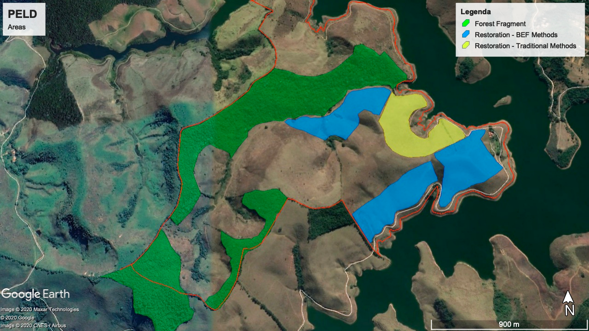

BEF-Atlantic project is a large-scale restoration project and tree diversity experiment in the Brazilian Atlantic Forest, designed to test the effect of tree richness and phylogenetic diversity on ecosystem functioning and restoration success of degraded tropical forests.

The main aim of **BEF-Atlantic** is to understand how tree diversity influences:

**(i)** the colonization of multiple taxonomic groups\
**(ii)** the interaction networks and multitrophic interactions\
**(iii)** the ecosystem processes and multifunctionality\
**(iv)** the feedback between plant-soil, soil-atmosphere and terrestrial-aquatic systems.

Ultimately this project aims to provide *c***lear guidelines for effective ecological restoration of the biodiversity and functioning of degraded Atlantic forest areas.**

The project was be implemented in 2021 on a degraded area dominated by abandoned pasture at the Fazenda Experimental do Núcleo de Integração Acadêmica para a Sustentabilidade Socioambiental da Universidade Federal de Juiz de Fora (NIASSA-UFJF).

